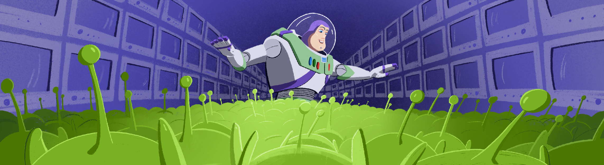

# 3DViewer

## Contents

1. [Introduction](#introduction)
2. [Information](#information)
3. [Implementation](#implementation)   

## Introduction



В данном проекте реализована программа для просмотра 3D моделей в каркасном виде (3D Viewer). Сами модели необходимо загружать из файлов формата .obj.
Доступна возможность просматривать 3D млоедли на экране с возможностью вращения, масштабирования и перемещения.
Примеры .obj файлов расположены в директории проекта.

## Information

В данном проекте реализована поддержка только списков вершин и поверхностей: (v и f) из .obj файла.

Пример файла формата .obj:
```
  # Список вершин, с координатами (x, y, z[, w]), w является не обязательным и по умолчанию равен 1.0
  v 0.123 0.234 0.345 1.0
  v ...
  ...
  # Определения поверхности (сторон)
  f v1 v2 v3
  f ...
  ...
```

## Implementation

- Обработка и парсинг .obj-файлов, аффинные преобразования объектов (перемещение, поворот, масштабирование) реализованы на Си. Графический пользовательнский интерфейс реализован на базе GUI библиотеки с API - QT.
- Сборка программы настроена с помощью Makefile со стандартным набором целей для GNU-программ: all, install, uninstall, clean, dvi, dist.
- Цель install производит сборку программы с помощью утилиты qmake.
- Цель dvi открывает информацию о проекте в .html файле.
- Цель dist архивирует файлы проекта. 
- Программа предоставляет возможность:
    - Загружать каркасную модель из файла формата obj (поддержка только списка вершин и поверхностей).
    - Перемещать модель на заданное расстояние относительно осей X, Y, Z.
    - Поворачивать модель на заданный угол относительно своих осей X, Y, Z
    - Масштабировать модель на заданное значение.
    - Программа позволяет настраивать тип проекции (параллельная и центральная)
    - Программа позволяет настраивать тип (сплошная, пунктирная), цвет и толщину ребер, способ отображения (отсутствует, круг, квадрат), цвет и размер вершин
    - Программа должна позволять выбирать цвет фона
    - Настройки сохраняются между перезапусками программы
    - Программа позволяет сохранять полученные ("отрендеренные") изображения в файл в форматах bmp и jpeg.
    - Программа позволяет по записывать небольшие "скринкасты" - текущие пользовательские аффинные преобразования загруженного объекта в gif-анимацию (640x480, 10fps, 5s)
- Графический пользовательский интерфейс содержит:
    - Кнопку для выбора файла с моделью и поле для вывода его названия.
    - Зону визуализации каркасной модели.
    - Кнопку/кнопки и поля ввода для перемещения модели. 
    - Кнопку/кнопки и поля ввода для поворота модели. 
    - Кнопку/кнопки и поля ввода для масштабирования модели.  
    - Информацию о загруженной модели - название файла, кол-во вершин и ребер.
    - Кнопки для выбора цвета фона, вершин и ребер.
    - Кнопки для выбора типа проекции.
    - Кнопки для выбора типа линии, настройка толщины ребер.
    - Кнопки для выбора типа и размера вершин.
    - Кнопка для создания сохранения изображения в файл.
    - Кнопка для создания и сохранения gif-анимации.